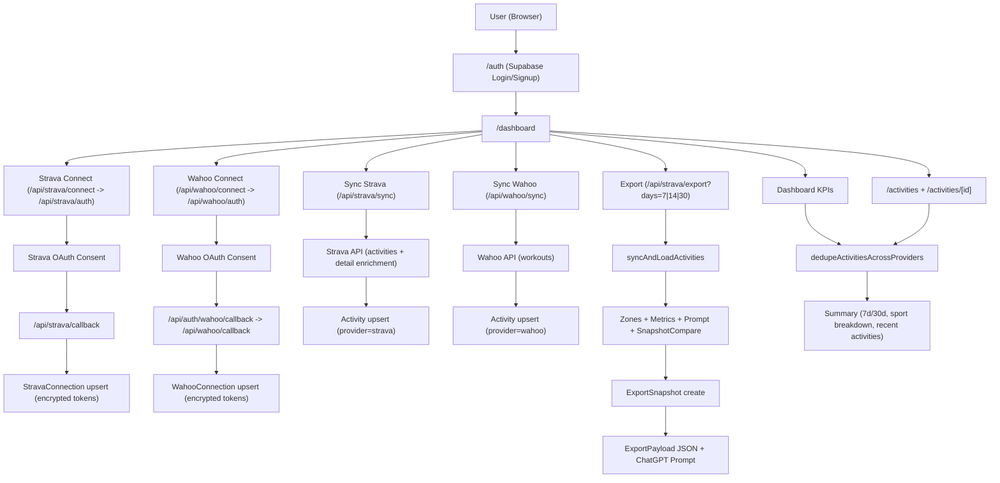
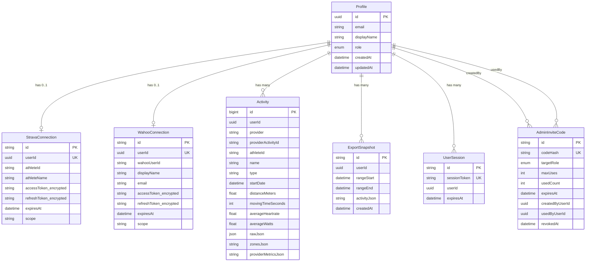

# Projektarchitektur: Strava Export

## 1) End-to-End Flow

## 2) Datenmodell (ER)

## 3) Wichtige Beziehungen und Zusammenhänge

1. `Profile` ist der zentrale Eigentümer aller fachlichen Daten.
2. `Activity` vereint Daten aus mehreren Providern (`provider=strava|wahoo`) in einem Modell.
3. Dedupe passiert logisch in der App-Schicht (nicht per DB-Constraint), damit Dashboard/Listen keine Duplikate doppelt zählen.
4. `ExportSnapshot` speichert jeden Exportzustand und ist Basis für Trend-/Delta-Berechnung.
5. Tokens werden verschlüsselt gespeichert; OAuth-Scopes steuern, welche Detaildaten (z. B. Profilzonen) verfügbar sind.
