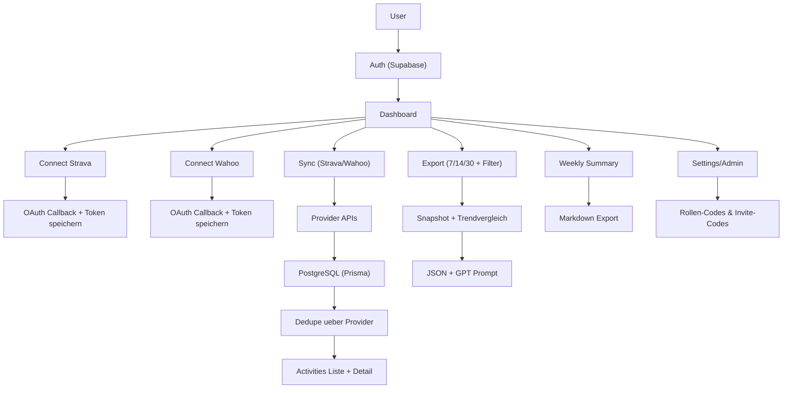
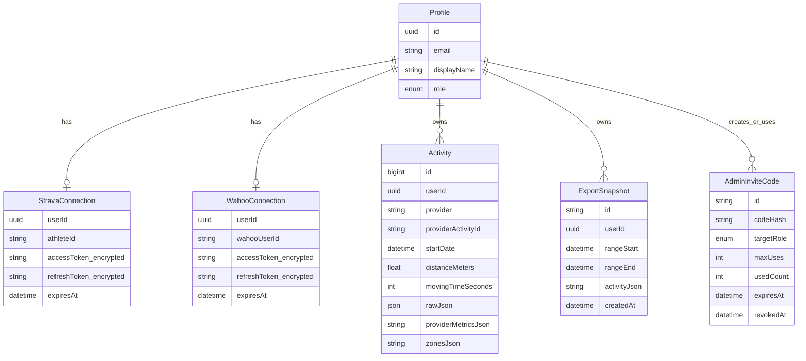
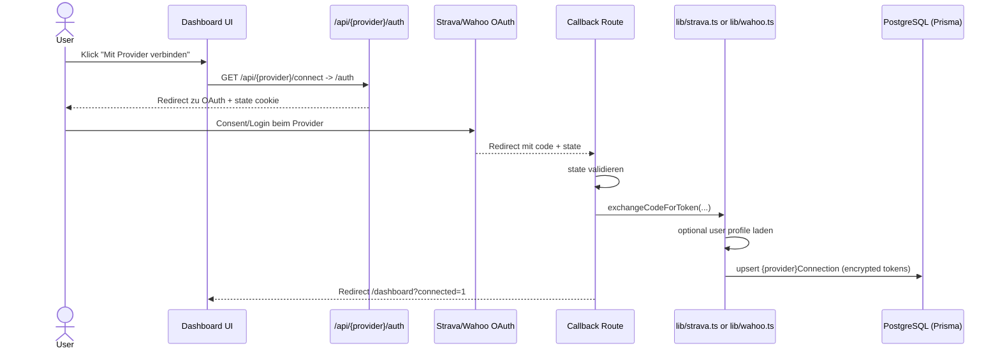
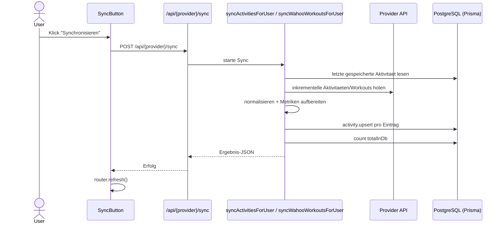
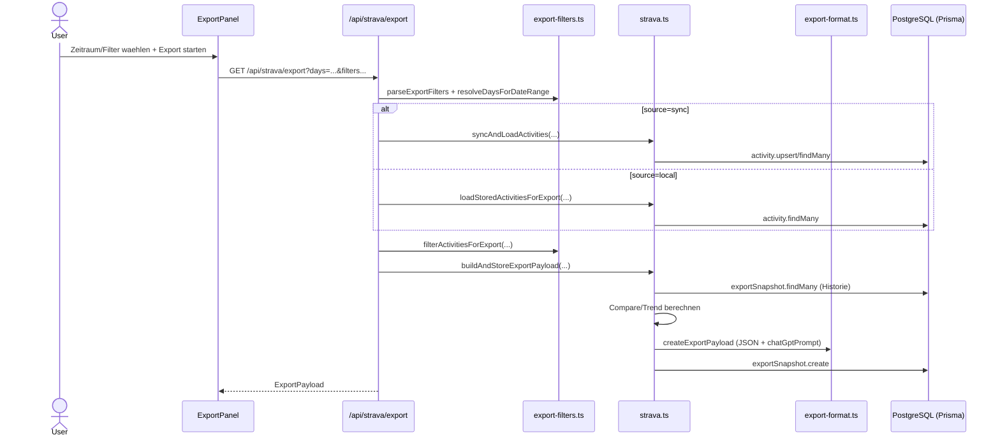
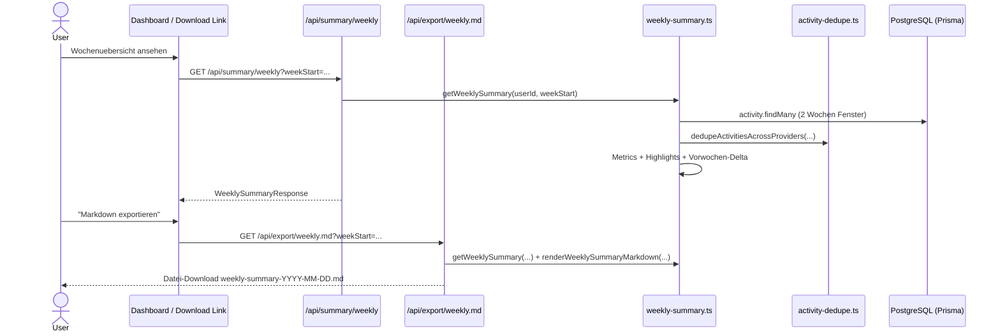

# Strava Export App - Gesamtuebersicht (All-in-One Export)

## 1) Inhalt, Ziel und Grundlogik

Die Anwendung ist ein persoenliches Trainings-Dashboard mit Fokus auf **ChatGPT-tauglichen Export**.

### Ziel
- Aktivitaeten je User aus Strava/Wahoo laden
- Daten vereinheitlichen und deduplizieren
- Analysefaehige Exporte erzeugen (JSON + GPT-Prompt)
- Wochenzusammenfassung und Verlauf (Snapshots/Trends) bereitstellen

### Grundlogik (kurz)
1. User loggt sich ein (Supabase Auth).
2. User verbindet Strava und/oder Wahoo via OAuth.
3. Sync holt Aktivitaeten vom Provider und speichert sie in PostgreSQL (Prisma).
4. App dedupliziert provideruebergreifende Duplikate.
5. Export baut JSON + ChatGPT-Prompt + Snapshot-Vergleich.
6. Dashboard/Activities/Weekly Summary visualisieren Kennzahlen, Details und Trends.

---

## 2) Userflows

1. Onboarding: Login -> Provider verbinden -> ersten 7-Tage-Export erstellen.
2. Connect-Flow: OAuth starten -> Callback -> Token sicher speichern.
3. Sync-Flow: manuell syncen -> inkrementell neue Aktivitäten laden -> upsert.
4. Export-Flow: Zeitraum/Filter wählen -> Export generieren -> copy/download.
5. Analyse-Flow: Snapshot-Deltas und Trends (Load, Intensity, Duration) ansehen.
6. Activities-Flow: filtern/suchen -> deduplizierte Liste -> Detailansicht.
7. Weekly-Flow: Wochenkennzahlen + Vergleich zur Vorwoche + Markdown-Download.
8. Settings/Admin-Flow: Profil, Rollen-Code, Invite-Codes, Account-Loeschung.

---

## 3) Unterfunktionen und Sinn

- `src/lib/auth.ts`: Auth-Guards, User-Kontext, Profil-Initialisierung.
- `src/lib/strava.ts`: Strava OAuth, Refresh, Sync, Export- und Snapshot-Logik.
- `src/lib/wahoo.ts`: Wahoo OAuth, Refresh, Workout-Sync.
- `src/lib/token-crypto.ts`: sichere Token-Verschluesselung.
- `src/lib/activity-dedupe.ts`: Dubletten zwischen Providern zusammenfuehren.
- `src/lib/dashboard.ts`: KPIs fuer Dashboard (7/30 Tage, Sportarten, Recents).
- `src/lib/export-filters.ts`: Filter-Parsing + Filteranwendung.
- `src/lib/export-format.ts`: JSON + ChatGPT-Ready Prompt erzeugen.
- `src/lib/weekly-summary.ts`: Wochenmetriken, Highlights, Delta zur Vorwoche.
- `src/lib/admin-codes.ts`: Rollen-/Invite-Code-Logik.
- `src/lib/route-errors.ts`: einheitliche Fehlerobjekte und API-Responses.

---

## 4) Architekturdiagramm (Flow)

---

## 5) Datenmodell (ER)

---

## 6) Request -> Route -> Lib -> DB Mapping

| Use Case | Route | Lib-Funktionen | DB-Operation |
|---|---|---|---|
| Login | `src/app/auth/sign-in/route.ts` | `createSupabaseServerClient().auth.signInWithPassword(...)` | keine direkte Prisma-Aenderung |
| Signup | `src/app/auth/sign-up/route.ts` | `signUp(...)`, `ensureAppUserExists(...)` | `profile.upsert` |
| Logout | `src/app/auth/sign-out/route.ts` | `disconnectStravaConnectionWithDeauthorize`, `disconnectWahooConnectionWithDeauthorize` | `stravaConnection.deleteMany`, `wahooConnection.deleteMany` |
| Strava OAuth Start | `src/app/api/strava/auth/route.ts` | `getAuthenticatedAppUserId`, `getEnv` | keine |
| Strava OAuth Callback | `src/app/api/strava/callback/route.ts` | `exchangeCodeForToken`, `upsertStravaConnection` | `stravaConnection.upsert` |
| Wahoo OAuth Start | `src/app/api/wahoo/auth/route.ts` | `getAuthenticatedAppUserId`, `canStartWahooOauth` | keine |
| Wahoo OAuth Callback | `src/app/api/auth/wahoo/callback/route.ts` | `exchangeCodeForWahooToken`, `fetchAuthenticatedWahooUser`, `upsertWahooConnection` | `wahooConnection.upsert` |
| Strava Sync | `src/app/api/strava/sync/route.ts` | `syncActivitiesForUser` | `activity.findFirst/count`, `activity.upsert` |
| Wahoo Sync | `src/app/api/wahoo/sync/route.ts` | `syncWahooWorkoutsForUser` | `activity.findFirst/count`, `activity.upsert` |
| Strava Export | `src/app/api/strava/export/route.ts` | `parseExportFilters`, `resolveDaysForDateRange`, `syncAndLoadActivities`/`loadStoredActivitiesForExport`, `filterActivitiesForExport`, `buildAndStoreExportPayload` | `activity.findMany/upsert`, `exportSnapshot.findMany/create` |
| Activities API | `src/app/api/activities/route.ts` | `dedupeActivitiesAcrossProviders` | `activity.findMany` |
| Weekly Summary API | `src/app/api/summary/weekly/route.ts` | `getWeeklySummary` | `activity.findMany` |
| Weekly Markdown Export | `src/app/api/export/weekly.md/route.ts` | `getWeeklySummary`, `renderWeeklySummaryMarkdown` | `activity.findMany` |
| Profil speichern | `src/app/settings/profile/route.ts` | `requireAppUserId` | `profile.update` |
| Rollen-Code einloesen | `src/app/settings/redeem-role-code/route.ts` | `hashAdminCode`, `matchesBootstrapSuperadminCode` | `profile.findUnique/update`, `adminInviteCode.findUnique/updateMany` |
| Invite-Code erstellen | `src/app/api/admin/invite-codes/create/route.ts` | `getAuthenticatedAppProfile`, `generateAdminInviteCodeValue`, `hashAdminCode` | `adminInviteCode.create` |
| Konto loeschen | `src/app/api/account/delete/route.ts` | `getAuthenticatedAppProfile`, Disconnect-Funktionen | `profile.delete` (+ Cascade) |

---

## 7) Sequence 1 - Connect (OAuth)

## 8) Sequence 2 - Sync

## 9) Sequence 3 - Export

## 10) Sequence 4 - Weekly Summary

